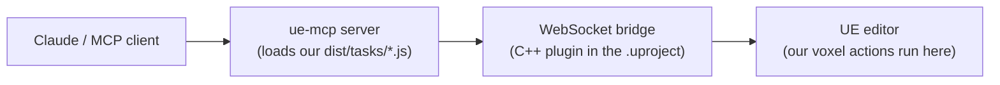

# Contributing

This repo is a **ue-mcp plugin**: a small npm package whose compiled task
classes are loaded *into* a running [ue-mcp](https://github.com/db-lyon/ue-mcp)
server, which in turn bridges to a live Unreal Editor. Understanding that
three-hop runtime is the key to developing here:



## Prerequisites

- **Node 20+.** `engines` says `>=18` (to match the parent ue-mcp), but a
  transitive dep (`@db-lyon/flowkit`) wants `>=20`. On Node 18 you'll see an
  `EBADENGINE` warning. If you use nvm, `nvm use 20` (or higher) in this repo.
- **ue-mcp** installed (it's a devDependency; `npm install` pulls it). The CLI
  used below is `npx ue-mcp`.
- **Unreal Engine 5.7** (the test project targets `5.7`).
- A **test UE project** with the Voxel Plugin enabled — see below.

## Build

```bash
npm install
npm run build      # tsc -> dist/. This is also the only CI validation (no unit tests yet).
```

Tasks extend `UeMcpTask` from `ue-mcp/task` — **never import `@db-lyon/flowkit`
directly**. flowkit is the host's implementation detail and arrives
transitively. See `src/tasks/*.ts` for the pattern.

## The test project

A throwaway UE project lives under `tests/voxel_plugin_tools/`. It is **not** the
plugin — it's the editor we point the bridge at. It has:

- The Voxel Plugin cloned into `Plugins/Voxel/` (from
  <https://github.com/VoxelPlugin/VoxelPlugin>, `stable` branch = Voxel Plugin 2)
  and enabled in `voxel_plugin_tools.uproject`. The vendored plugin is **not**
  committed to this repo.
- A `ue-mcp.yml` (server config) and `.mcp.json` (MCP-client registration),
  both generated by `ue-mcp init <uproject>`.

## Local dev: registering THIS plugin with the server

The server discovers plugins by **npm package name**: it walks up from the
project dir looking for `node_modules/<name>` with a valid `ue-mcp.plugin.yml`,
then loads the entry listed under `plugins:` in `ue-mcp.yml`.

> ⚠️ **Do not** run `ue-mcp plugin install voxel-plugin-tools` for local work —
> that `npm install`s the *published* package from npm, shadowing your working
> copy. There is no `link`/`dev` subcommand, so use `npm link` instead.
>
> `npm install file:../../` also does **not** work here: the repo root is an
> *ancestor* of the test project (the dependent lives inside the dependency),
> and npm's symlink logic silently no-ops on that cycle.

One-time setup:

```bash
# 1. Register a global symlink for this package (run at the repo root)
npm link

# 2. Consume it from the test project
cd tests/voxel_plugin_tools
npm link voxel-plugin-tools
#   -> node_modules/voxel-plugin-tools  ->  <repo root>   (live symlink)
```

Then add the plugin to the test project's `tests/voxel_plugin_tools/ue-mcp.yml`:

```yaml
ue-mcp:
  version: 1
plugins:
  - name: voxel-plugin-tools
tasks: {}
flows: {}
```

(No `version:` pin during dev — a pin must match the installed version exactly
and just creates friction. Our plugin ships no native module, so the bridge-ABI
deploy step the CLI normally runs doesn't apply.)

## Connecting the MCP client

`ue-mcp init <uproject>` writes `.mcp.json` next to the `.uproject`. Claude Code
only auto-discovers `.mcp.json` at the **session's project root** (this repo
root), not in subdirectories — so a copy lives at the repo root pointing the
server command at the test `.uproject` (absolute path, so location-independent).
`.mcp.json` is gitignored. After creating/editing it, **restart the MCP client**
so the server is (re)spawned, and approve it on first load.

> ⚠️ **Register the server under a unique name — not `ue-mcp`.** MCP server names
> are global to the client: if two registrations share a name, they collide and
> one silently wins. This repo's root `.mcp.json` registers the server as
> **`ue-mcp-voxel`** precisely because a global `ue-mcp` server (bound to a
> different project) would otherwise shadow it. Its tools then surface as
> `mcp__ue-mcp-voxel__<category>` (`project`, `level`, `editor`, `asset`, `pcg`,
> `reflection`, …). Pick any unique name; just don't reuse one already registered
> elsewhere in your client config.

## The iteration loop

Because the link is live, the cycle is:

```bash
# edit src/tasks/*.ts
npm run build                 # refresh dist/ (the symlink exposes it immediately)
# restart the ue-mcp server   # plugins load only at server startup
```

Restarting the server = reconnecting the `ue-mcp-voxel` MCP server in your client
(plugins are read from `ue-mcp.yml` once, on boot). Then verify:

```
plugins(action="list")        # should show voxel-plugin-tools + its voxel_* actions
project(action="get_status")  # editorConnected: true once the UE editor is up
```

Testing an action end-to-end also requires the **UE editor running** with the
bridge — launch it with `editor(action="start_editor")` or open the project in
UE. The first launch after enabling the Voxel plugin triggers a (slow) plugin
compile.
