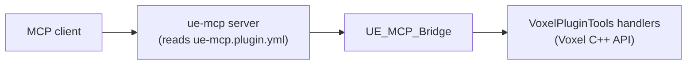

# Contributing

Every action is a C++ handler in the `VoxelPluginTools` editor module (`ue/Plugins/VoxelPluginTools`), registered on the ue-mcp bridge and surfaced as the `voxel` category through `nativeModule` in `ue-mcp.plugin.yml`. There is no TypeScript or Python layer: Voxel exposes most of what these actions do to neither.


```mermaid
flowchart LR
    A["MCP client"] --> B["ue-mcp server<br/>(reads ue-mcp.plugin.yml)"]
    B --> C["UE_MCP_Bridge"]
    C --> D["VoxelPluginTools handlers<br/>(Voxel C++ API)"]
```

## Layout

- `Private/VoxelToolsCommon.*`: shared parsing, actor lookup, errors, handler registry.
- `Private/Voxel*Handlers.cpp`: one file per area (world, stamps, sculpt and queries, assets and PCG, graphs). Each keeps its helpers in an anonymous namespace; the module builds without unity for that reason.
- `Private/VoxelPluginToolsModule.cpp`: registers handlers; saves content packages a call dirtied and turns non-finite numbers into `null` before replying.
- `ue-mcp.plugin.yml`: one entry per handler with `effect`, a description ending in a `Params:` clause, and a described schema field per parameter.

## Rules

- Read the Voxel header (and cite it) before calling an API; Voxel `dev` moves.
- Validate every input before mutating; wrap mutations in `FScopedTransaction` with `Modify()` first.
- Never `check()` or `ensure()` on user input, including reflected properties a Voxel update could rename.
- Never name a parameter `action` (the gateway's selector) or one that collides with a built-in.

## Test project

`tests/voxel_plugin_tools/` (UE 5.8) is the editor these handlers are developed against. Not committed: `Plugins/Voxel` (clone of <https://github.com/VoxelPlugin/VoxelPlugin>, `dev`), `Plugins/UE_MCP_Bridge` (`npx ue-mcp-deploy .` from that folder), and `Plugins/VoxelPluginTools`, a junction to `ue/Plugins/VoxelPluginTools` so builds compile the working copy.

## Loop

```bash
npm install
npm run check                       # manifest vs host schema vs C++ registrations, plus skills
# close the test editor (Live Coding blocks builds), then:
"<UE_5.8>/Engine/Build/BatchFiles/Build.bat" voxel_plugin_toolsEditor Win64 Development -Project=<abs path>/tests/voxel_plugin_tools/voxel_plugin_tools.uproject -WaitMutex
# start the editor, open an empty map, then:
node scripts/live-test.mjs          # every action against the live editor; must pass before release
node scripts/bridge-call.mjs <method> '<json>'   # one call by hand
```

## Release

Bump `version` in `package.json` and `VersionName` in the `.uplugin`, merge to `main`; CI tags, publishes to npm with provenance, and creates the GitHub release.
