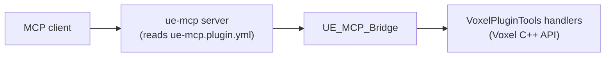

# Contributing

Every action is a C++ handler in the `VoxelPluginTools` editor module (`ue/Plugins/VoxelPluginTools`), registered on the ue-mcp bridge and surfaced as the `voxel` category through `nativeModule` in `ue-mcp.plugin.yml`. There is no TypeScript or Python layer: Voxel exposes most of what these actions do to neither.


```mermaid
flowchart LR
    A["MCP client"] --> B["ue-mcp server<br/>(reads ue-mcp.plugin.yml)"]
    B --> C["UE_MCP_Bridge"]
    C --> D["VoxelPluginTools handlers<br/>(Voxel C++ API)"]
```

## Layout

- `Private/VoxelToolsCommon.*`: shared parsing, actor lookup, errors, handler registry, shared contract pieces (`Spec::`).
- Contracts are enforced by the bridge itself (`UEMCP::ContractViolation`, bridge ABI 2) on every call, whoever sent it; handlers do not re-check what a contract states.
- `Private/Voxel*Handlers.cpp`: one file per area (world, stamps, sculpt and queries, assets and PCG, graphs). Each keeps its helpers in an anonymous namespace; the module builds without unity for that reason.
- `Private/VoxelPluginToolsModule.cpp`: registers each handler with its contract (bridge ABI 2) and its timeout, logs an error for any contract the bridge refuses; saves the content packages a call dirtied (after flushing Voxel's graph compilation) and turns non-finite numbers into `null` before replying.
- Each `Add*Handlers` registers `Out.Add({ name, fn, { params }, rules })`: every key the handler reads, with its exact type, required flag, enum (the spelling the code accepts), range, nested fields, variants and choices, and `save` on every mutating handler. One sentence per description, stating defaults and units.
- `ue-mcp.plugin.yml`: one entry per handler with `effect`, a description without a `Params:` clause (the server generates it from the contract), and `timeoutSeconds` for long handlers.
- `handler-specs.json`: the contracts recorded from a live editor (`ue-mcp plugin record-specs --project <uproject>`), which the server builds the surface from. Re-record after any contract change; `--check` fails when it is stale.
- `skills/<name>/SKILL.md`: one skill per workflow, installed as `voxel-plugin-tools-<name>`. Follow ue-mcp's skill guidelines (`docs/plugins-authoring.md`, Skills) and its own skills' style. Every behaviour a skill states is read from the handler code or the Voxel source, never from memory; write call examples as `voxel(action="...")`.
- `knowledge/voxel.md`: the short delta ue-mcp attaches to the `voxel` category's docs.
- `npm run check` (C7) holds the skills, the knowledge file and README.md to the surface: every `voxel_*` name is a manifest handler, every `voxel(action=...)` call passes only keys its recorded contract declares, and every core `category(action=...)` call names a ue-mcp action. `ue-mcp plugin check-skills` reads only SKILL.md and does not resolve a native module's category (db-lyon/ue-mcp#1316).

## Rules

- Read the Voxel header (and cite it) before calling an API; Voxel `dev` moves.
- Validate every input before mutating; wrap mutations in `FScopedTransaction` with `Modify()` first.
- Never `check()` or `ensure()` on user input, including reflected properties a Voxel update could rename.
- Never declare a routing name the dispatcher consumes (`action`, `timeoutMs`, `select`, `omit`, `editor`, `toEditor`); the bridge refuses the contract.
- A handler refuses input it would otherwise coerce, ignore or default: no lenient booleans, no fields an op does not read, no empty string standing in for an omitted one.

## Test project

`tests/voxel_plugin_tools/` (UE 5.8) is the editor these handlers are developed against. Not committed: `Plugins/Voxel` (clone of <https://github.com/VoxelPlugin/VoxelPlugin>, `dev`), `Plugins/UE_MCP_Bridge` (`npx ue-mcp-deploy .` from that folder), and `Plugins/VoxelPluginTools`, a junction to `ue/Plugins/VoxelPluginTools` so builds compile the working copy.

## Loop

```bash
npm install
npm run check                       # manifest vs host schema vs C++ registrations, action names in docs, skills
# close the test editor (Live Coding blocks builds), then:
"<UE_5.8>/Engine/Build/BatchFiles/Build.bat" voxel_plugin_toolsEditor Win64 Development -Project=<abs path>/tests/voxel_plugin_tools/voxel_plugin_tools.uproject -WaitMutex
# start the editor, open an empty map, then:
node scripts/live-test.mjs          # every action, and every contract rule refused, against the live editor; must pass before release
npx ue-mcp plugin record-specs --project <abs path>/tests/voxel_plugin_tools/voxel_plugin_tools.uproject   # after a contract change
node scripts/bridge-call.mjs <method> '<json>'   # one call by hand
```

## Release

Bump `version` in `package.json` and `VersionName` in the `.uplugin`, merge to `main`; CI tags, publishes to npm with provenance, and creates the GitHub release.
