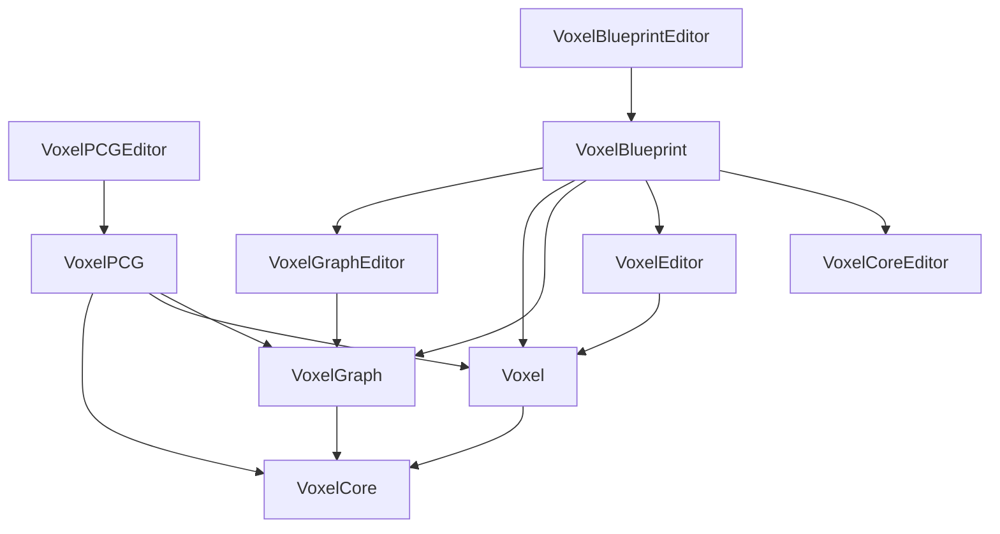

# Voxel Plugin — Module Map

The plugin ships **twelve modules** plus a UHT (UnrealHeaderTool) extension. Every module funnels through a single `VoxelGlobalMethods.SetupVoxelModule` shim defined in `VoxelCore/VoxelCore.Build.cs`, which standardizes C++20, IWYU=None, unity builds, the shared PCH (`VoxelPCH.h` for runtime, `VoxelCoreEditorPCH.h` for editor), and `FPSemanticsMode.Precise` (so PCG point output is identical on client and server).

## Module list

| Module | Type | Loading phase | Public headers? | Role |
|---|---|---|---|---|
| `VoxelCore` | Runtime | `PostConfigInit` | yes | Foundational containers, math, threading, messaging, ISPC bridge, dependency tracking. No voxel concepts. |
| `VoxelCoreEditor` | Editor | `Default` | yes | Slate widgets, detail customizations, asset wizards used by every other editor module. |
| `VoxelGraph` | Runtime | `Default` | yes | Visual-graph asset, compilation pipeline, typed buffers, function-library nodes. |
| `VoxelGraphEditor` | Editor | `Default` | yes | Graph editor UI, node panels, preview viewport, message log. |
| `Voxel` | Runtime | `PostConfigInit` | yes | The gameplay-facing module: `AVoxelWorld`, stamps, layers, mega-material, render/collision/navigation, sculpt/spline/shape/scatter. |
| `VoxelEditor` | Editor | `Default` | yes | World/stamp/layer detail panels, interactive sculpt tools, placement mode integration. |
| `VoxelBlueprint` | UncookedOnly | `PostConfigInit` | yes | Kismet (BP) K2 nodes that expose voxel-graph parameters and the make/break pin-value flow. Editor-time only. |
| `VoxelBlueprintEditor` | Editor | `Default` | no (private only) | Slate pieces specific to the BP K2 nodes. |
| `VoxelPCG` | Runtime | `Default` | yes | Bridge to Epic's PCG framework. PCG nodes that read/write voxel state plus voxel-graph nodes that operate on point sets. |
| `VoxelPCGEditor` | Editor | `Default` | no (private only) | PCG node UI/customizations. |
| `VoxelTests` | Runtime | `Default` | no | Automation tests; include-correctness checks when `VoxelDevWorkflow.txt` is present. |
| `VoxelUHT` | UBT plugin | n/a | n/a | Custom UnrealHeaderTool exporter (`*.generated.voxel.cpp`) that codegens function-library wrappers around `UVoxelFunctionLibrary` and `FVoxelRuntimePinValue`. |

`UncookedOnly` means `VoxelBlueprint` is built into editor/uncooked targets only — it ships nothing in packaged builds, because BP K2 node classes only exist to extend the Kismet compiler.

## Loading phases

Two modules load at `PostConfigInit` (very early, before most engine systems):

- `VoxelCore` — needed early so `FVoxelMessageManager`, the `FVoxelDeveloperSettings` CDO, and the ISPC runtime are available before subsystems initialize.
- `Voxel` — needs early load so `AVoxelWorld` subsystems can register themselves before the world begins streaming.

`VoxelBlueprint` also loads `PostConfigInit` (but as `UncookedOnly`) so its K2 node factories are registered before the Blueprint editor opens any assets.

Everything else loads at the `Default` phase.

## Dependency graph

(Arrow direction: A → B means A depends on B.)

Concrete declarations from the `*.Build.cs` files:

- `VoxelCore` adds engine deps `Chaos`, `Renderer`, `Projects`, `ApplicationCore`, `TraceLog`. Private deps include `zlib`, `UElibPNG`, `Json`, `HTTP`, `Landscape`, `EventLoop`, `MoviePlayer`. Editor builds pull in `MaterialEditor`, `UATHelper`, `GraphEditor`, `DesktopPlatform`.
- `Voxel` depends on `VoxelGraph`, plus `Chaos`, `Renderer`, `PhysicsCore`, `Landscape`, `NavigationSystem`, `PCG`, `MeshDescription`, `StaticMeshDescription`.
- `VoxelGraph` depends only on the standard set plus `TraceLog`, `Chaos`, `PhysicsCore`, `Json` (and `MessageLog` in editor).
- `VoxelPCG` depends on `Voxel`, `VoxelGraph`, `PCG`.
- `VoxelBlueprint` depends on `VoxelCoreEditor`, `Voxel`, `VoxelEditor`, `VoxelGraph`, `VoxelGraphEditor`, plus `BlueprintGraph` and `KismetCompiler` for K2 node integration.
- `VoxelEditor` is the heaviest editor module — it depends on `Voxel`, `VoxelPCG`, `VoxelGraph`, `VoxelGraphEditor`, plus the full editor surface (`LevelEditor`, `AssetTools`, `PlacementMode`, `InteractiveToolsFramework`, `SceneOutliner`, `DetailCustomizations`, etc.).
- `VoxelTests` depends only on `Json` and `NavigationSystem`.

## ISPC and the build script

`VoxelCore.Build.cs` defines `VoxelISPCCompiler`, which scans every module's `Source/<Module>/**.ispc` and `**.isph` files and generates a per-platform build script (`Intermediate/ISPC/<Platform>/<Arch>/<Editor>/<Config>/Build.ps1` or `Build.sh`). On Windows it downloads the same ISPC binary Unreal uses (`UnrealEngine-28863921/...`) if the engine copy is missing. ISPC is built into per-module static libraries (`libVoxel.a`, `libVoxelCore.a`, etc.) linked via `PublicAdditionalLibraries`.

The cross-platform target matrix is hard-coded to:

- `Win64` / `Linux` / `Mac (x64)` / `Android (x64)`: `avx512skx-i32x8`, `avx2`, `avx`, `sse4`
- `LinuxArm64` / `Mac (arm64)` / `Android (arm64)` / `iOS` / `VisionOS`: `neon`

## Build toggles

Two opt-in flags live as marker files in the plugin's parent `Plugins/` directory:

- `VoxelDevWorkflow.txt` — disables unity builds for `Win64` and `Mac` and switches off forced code optimization so iteration with a debugger is bearable. Also installs the IDE-friendly include-path that lets ReSharper/Rider see ISPC generated headers.
- `VoxelDebug.txt` — forces the `VOXEL_DEBUG=1` define regardless of build configuration. Equivalently, building `Debug` (or `DebugGame` with dev workflow on) flips this on automatically.

There's also `CheckPackaging.txt`: if present, all optimization is disabled (build-only sanity pass).

## UHT extension

`VoxelUHT/Program.cs` defines a single `[UhtExporter]` named `"VoxelGraph"` that:

1. Locates `UVoxelFunctionLibrary` and `FVoxelRuntimePinValue` in the parsed metadata.
2. Walks every header in the `VoxelGraph` module.
3. For every class deriving from `UVoxelFunctionLibrary`, emits a `*.generated.voxel.cpp` file with the C++ glue that turns `UFUNCTION`-tagged static methods into compute-graph nodes.

This is why writing a new voxel-graph function library node only requires a `UFUNCTION` declaration — the boilerplate that wires it into the graph system is generated by this UHT plugin at build time.

## What's in each module's `Public/`

| Module | Subfolders under `Public/` |
|---|---|
| `VoxelCore` | `VoxelMinimal/`, `VoxelMinimal/Containers/`, `VoxelMinimal/Utilities/`, root |
| `Voxel` | `Collision/`, `Graphs/`, `Heightmap/`, `MegaMaterial/`, `Nanite/`, `Navigation/`, `Render/`, `Scatter/`, `Sculpt/`, `Shape/`, `Spline/`, `StaticMesh/`, `Surface/`, `Texture/`, root |
| `VoxelGraph` | `Buffer/`, `FunctionLibrary/`, `Nodes/`, `Preview/`, `Utilities/`, root |
| `VoxelPCG` | flat (no subfolders) |
| `VoxelBlueprint` | flat (five K2 node headers) |
| `VoxelCoreEditor`, `VoxelEditor`, `VoxelGraphEditor` | each has a `Public/`, but most concrete UI lives in `Private/` |
| `VoxelBlueprintEditor`, `VoxelPCGEditor`, `VoxelTests` | private-only, no `Public/` |

For per-module API detail see [VoxelCore](VoxelCore.md), [Voxel](Voxel.md), [VoxelGraph](VoxelGraph.md), [VoxelPCG](VoxelPCG.md), [VoxelBlueprint](VoxelBlueprint.md).
