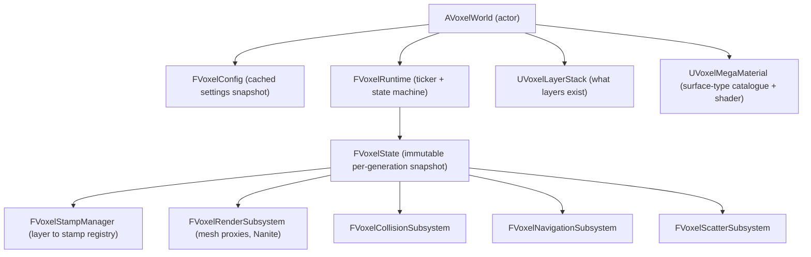
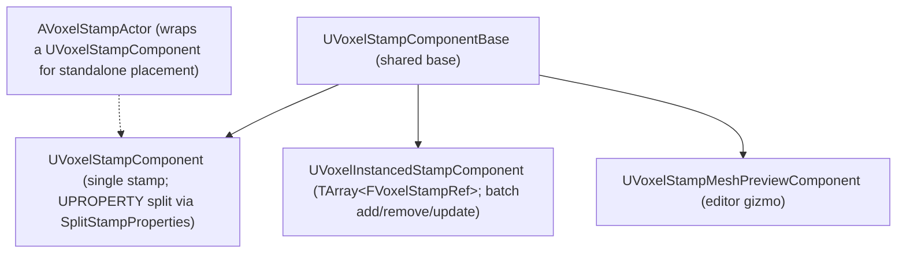

# Voxel — API Reference

The gameplay-facing module. Everything users actually place into a level — voxel worlds, stamps, layers, materials, sculpt tools, scatter — lives here. This is by far the largest module by surface area; ~14 subfolders under `Public/` plus ~60 root headers.

Path: `Plugins/Voxel/Source/Voxel/Public/`. Loads at `PostConfigInit`. Depends on `VoxelGraph`, `Chaos`, `Renderer`, `PhysicsCore`, `Landscape`, `NavigationSystem`, `PCG`, `MeshDescription`.

Official knowledgebase covering usage (not API): <https://docs.voxelplugin.com/knowledgebase>. The KB sections on **Working with Stamps**, **Surface Types & Metadata**, and **Gameplay Systems & Blueprint API** are the natural companions to this page.

## Top-level flow



A user authors **stamps** (sculpt strokes, spline curves, heightmaps, graphs). Stamps go into **layers** (height or volume). At runtime, the **stamp manager** snapshots the layer contents into a **state**, and **subsystems** evaluate that state into render meshes, colliders, and navmesh.

## World and runtime

### `AVoxelWorld`

The actor users drop into a level. Configuration is Blueprint-exposed and small enough to enumerate:

| Property | Type | Notes |
|---|---|---|
| `VoxelSize` | `int32` (cm, ≥1) | Edge length of one voxel. |
| `LODQuality` | `FVoxelLODQuality` | Min/max quality tiers — mesh starts at min and refines up. |
| `QualityExponent` | `double` | LOD bias; higher → further chunks stay high-res. |
| `MegaMaterial` | `UVoxelMegaMaterial*` | Global material catalogue. |
| `LayerStack` | `UVoxelLayerStack*` | The layers this world reads. |
| `bEnableNanite` | `bool` | Switch between Nanite and traditional mesh components. |
| `bCreateRuntimeOnBeginPlay` | `bool` | If false, call `CreateRuntime` manually. |
| `bWaitOnBeginPlay` | `bool` | If true, `BeginPlay` blocks until the first generation pass completes. |
| `bWaitForPCG` | `bool` | If true, generation also waits on PCG completion. |
| `bLimitMaxLOD` / `MaxLOD` | `bool`/`int32` | Cap rendered LOD. |
| `MaxBackgroundTasks` | `int32` | Worker concurrency cap. |

Notable methods (paraphrased): `CreateRuntime()`, `DestroyRuntime()`, `IsVoxelWorldReady()`, `GetRuntime()`. The runtime also dispatches a dynamic `FOnVoxelWorldEvent` for ready-state transitions.

The world owns a `UVoxelWorldRootComponent` for transform/replication.

### `FVoxelRuntime`

The ticker. Owns current/next `FVoxelState`s and the worker components (mesh, collision, nav). Adds/removes components dynamically as LOD shifts.

```cpp
TSharedPtr<FVoxelState> GetState();      // currently rendered
TSharedPtr<FVoxelState> GetNewState();   // being computed
template<typename T> T* NewComponent();  // add a runtime component
void RemoveComponent(UActorComponent*);
FSimpleMulticastDelegate OnInvalidated;
```

### `FVoxelState`

Immutable per-generation snapshot — bundles `FVoxelConfig`, the resolved layers, the surface-type table, and the task context. Subsystems pin a `FVoxelState` for the duration of their work so concurrent re-generation doesn't mutate under them.

```cpp
template<typename T> T& GetSubsystem();   // typed access to FVoxelSubsystem
bool IsReadyToRender();
bool IsRendered();
```

### `FVoxelConfig` / `VoxelSettings.h` / `VoxelComponentSettings.h` / `FVoxelLODQuality`

Configuration plumbing: world-level cached settings, per-component overrides, the project-settings panel, and the min/max LOD tier struct.

### `FVoxelSubsystem` (`VoxelSubsystem.h`)

Virtual-struct base for everything pluggable (stamps, render, collision, nav, scatter). Lifecycle: `LoadFromPrevious(FVoxelSubsystem&)`, `Initialize(FVoxelState&)`, `Compute(FVoxelState&)`, `Render(FVoxelState&)`. `UVoxelSubsystemGCObject` is the small helper that keeps subsystem-held `UObject` refs alive across state transitions.

### Misc world-level

- **`VoxelChunkKey.h`** — `FVoxelChunkKey`: `(LOD, IntVector position)`, with parent/child traversal.
- **`VoxelDebugActor.h`** — visualizer placeholder.
- **`VoxelCellGenerator.h`** — low-level cell iteration helper.
- **`VoxelBreadcrumbs.h`** — `FVoxelBreadcrumbs`: traces *which* stamps/layers contributed to a sampled voxel, for debugging "why is this terrain wrong?".
- **`VoxelValuesDump.h`** — dump value grids to disk for offline inspection.
- **`VoxelVersion.h`** — version tracking for asset migration.

## Stamps

The central authoring primitive. A **stamp** is a piece of data (a sculpt brush stroke, a spline, a heightmap, a graph) that contributes to one or more layers. Stamps stack, blend, and prioritize.

KB: <https://docs.voxelplugin.com/knowledgebase/working-with-stamps/>.

### `FVoxelStamp` (virtual struct base)

```cpp
FTransform           Transform;
EVoxelStampBehavior  Behavior;   // bitmask: AffectShape | AffectSurfaceType | AffectMetadata
int32                Priority;   // higher = applied later
float                Smoothness; // falloff radius
TInterval<int32>     LODRange;   // inclusive LODs this stamp affects
```

Plus virtual `FixupProperties()` (normalize after deserialize), `GetAsset()`, `GetRequiredComponents()`.

### Stamp categories

| Folder | Stamp class(es) | Source |
|---|---|---|
| `Shape/` | `FVoxelShapeStamp` wrapping `FVoxelCubeShape`, `FVoxelSphereShape`, `FVoxelPlaneShape` | Geometric primitives. KB: Shape Stamps. |
| `Spline/` | `FVoxelSplineStamp` (height + volume variants) | Curve-driven; pulls control points from `UVoxelSplineComponent`. `FVoxelSplineSegment` is the runtime baked segment. KB: Spline Stamps. |
| `Sculpt/Height/` | `FVoxelHeightSculptStamp` | Persistent painted/sculpted brush data. Saved as `UVoxelHeightSculptSaveAsset`. KB: Sculpt Stamps. |
| `Sculpt/Volume/` | `FVoxelVolumeSculptStamp` | Same for volumes. |
| `Heightmap/` | `FVoxelHeightmapStamp` | Heightmap texture → height layer. |
| `StaticMesh/` | `FVoxelMeshStamp` | Voxelizes a `UStaticMesh` into a layer. |
| `Graphs/` | `FVoxelHeightGraphStamp`, `FVoxelVolumeGraphStamp` | Executes a `UVoxelHeightGraph` / `UVoxelVolumeGraph` to produce values per-voxel. |

All concrete stamps derive from either `FVoxelHeightStamp` or `FVoxelVolumeStamp`:

```cpp
struct FVoxelHeightStamp : FVoxelStamp
{
    UVoxelHeightLayer* Layer;
    EVoxelHeightBlendMode BlendMode;       // Max/Min/Override/Add/Subtract/Multiply/Smooth/...
    TArray<UVoxelHeightLayer*> AdditionalLayers;
};

struct FVoxelVolumeStamp : FVoxelStamp
{
    UVoxelVolumeLayer* Layer;
    EVoxelVolumeBlendMode BlendMode;       // Additive/Subtractive/Intersect/ReplaceIfSmaller
};
```

Blend-mode enums: `VoxelHeightBlendMode.h`, `VoxelVolumeBlendMode.h`. Blend logic: `VoxelBlendModeUtilities.h`. KB has a full page on blend mode semantics and override stamps.

### Stamp refs

Stamps are stored polymorphically. The handle types in `VoxelStampRef.h` / `VoxelStampRefInner.h` / `VoxelWeakStampRef.h` provide type-safe shared/weak ownership:

```cpp
FVoxelStampRef ref = ...;
FVoxelHeightStampRef heightRef = ref.CastTo<FVoxelHeightStamp>();
FVoxelStampRef copy = ref.MakeCopy();
TSharedPtr<FVoxelHeightStamp> ptr = heightRef.ToSharedPtr<FVoxelHeightStamp>();
```

`GENERATED_VOXEL_STAMP_REF_BODY` (macro) auto-generates the typed wrappers for any concrete stamp type. `FVoxelStampDelta` carries before/after deltas for change detection.

`_K2` variants (`VoxelStamp_K2.h`, `VoxelHeightStamp_K2.h`, `VoxelVolumeStamp_K2.h`) wrap the structs for Blueprint reflection.

### Actor / component tier



`UVoxelStampComponentInterface` is the contract anything implementing stamp-like behavior follows. `UVoxelStampBehavior` exposes the behavior bitmask to BP.

`UVoxelStampBlueprintFunctionLibrary` — `CastToStamp<T>()` and friends for BP.

### Stamp manager and runtime

`FVoxelStampManager` (`VoxelStampManager.h`) is the world subsystem that:

1. Holds a registry of all `FVoxelStampRef`s currently active, keyed by layer.
2. Lazily resolves each `FVoxelStampRef` → `FVoxelStampIndex` → `FVoxelStampRuntime` (the serialized, applyable form).
3. Fires `OnChanged` whenever the registry mutates so dependent subsystems can invalidate.

```cpp
void  RegisterStamps(layerId, refs);
void  UnregisterStamps(layerId, refs);
void  UpdateStamp(layerId, ref);
auto& FindOrAddLayer(layerId) -> FVoxelStampLayerManager&;
auto  ResolveStampRuntime(FVoxelStampIndex) -> FVoxelStampRuntime*;
FSimpleMulticastDelegate OnChanged;
```

Supporting headers: `VoxelStampIndex`, `VoxelStampQuery`, `VoxelStampQueryImpl.isph` (ISPC), `VoxelStampTransform`, `VoxelStampTransformImpl.isph`, `VoxelStampUtilities`, `VoxelStampRuntime`, `VoxelHeightStampRuntime` / `VoxelVolumeStampRuntime` (the per-type runtime), `VoxelInstancedStampComponent`.

## Layers

KB context: stamps live *in* layers; layers stack in priority order on the world.

### Definitions

- **`UVoxelLayer`** — abstract base. Identifies a conceptual channel.
- **`UVoxelHeightLayer`** — heightfield-style (one elevation per X/Y).
- **`UVoxelVolumeLayer`** — volumetric (signed-distance field).
- **`UVoxelLayerStack`** — ordered container:
  ```cpp
  TArray<UVoxelHeightLayer*> HeightLayers;
  TArray<UVoxelVolumeLayer*> VolumeLayers;
  float MaxDistance;                      // distance-field extent for height layers
  FSimpleMulticastDelegate OnChanged;
  ```
- **`FVoxelStackLayer`** / **`VoxelLayerStack.h`** — runtime wrapper holding a weak layer pointer plus owner-world reference. Used in `FVoxelQuery` and the no-clipping component.
- **`VoxelLayerBase.h`** — shared layer-side internals.
- **`VoxelLayers.h`** — internal layer-to-index registry inherited from `FVoxelSubsystem`.

## Metadata

Per-voxel attributes layered on top of the geometric values.

| Header | Class | Inner type | Notes |
|---|---|---|---|
| `VoxelMetadata.h` | `UVoxelMetadata` | (abstract) | Asset declaring a metadata channel. |
| `VoxelFloatMetadata.h` | `UVoxelFloatMetadata` | `float` | Packing modes: 1-byte (0..1), 2-byte (fp16), 4-byte. |
| `VoxelLinearColorMetadata.h` | `UVoxelLinearColorMetadata` | `FLinearColor` | RGBA. |
| `VoxelNormalMetadata.h` | `UVoxelNormalMetadata` | `FVector` | Octahedral encoding. |

Each has a matching `*MetadataRef.h` (`FVoxelFloatMetadataRef`, etc.) — type-erased handles backed by buffer storage. `FVoxelMetadataRef` is the polymorphic base.

`VoxelMetadataMaterialType.h` — `EVoxelMetadataMaterialType` enum for the GPU packing strategy. `VoxelMetadataOverrides.h` — per-stamp metadata-value override map.

KB: <https://docs.voxelplugin.com/knowledgebase/materials/working-with-metadata.html>.

## MegaMaterial

`UVoxelMegaMaterial` (`MegaMaterial/` subfolder) is a multi-surface material container that the world references via its `MegaMaterial` property.

Properties:

- `SurfaceTypes` (`TArray<UVoxelSurfaceTypeAsset*>`) — the catalogue.
- `bDetectNewSurfaces` — editor warning when a graph emits an unknown type.
- `CustomNonNaniteMaterial`, `CustomNaniteDisplacementMaterial` — override the generated material at either tier.
- `AttributePostProcess` — global material function applied after attribute resolution.
- `bEnableSmoothBlends`, `bGenerateMaskedMaterial`, `bSetHasPixelAnimation` — quality flags.

Companions:

- `UVoxelMegaMaterialProxy` / `UVoxelMegaMaterialCache` — runtime caching + compile pipeline.
- Material expressions for shader use: `MaterialExpressionGetVoxelMaterialInfo`, `MaterialExpressionGetVoxelMetadata`, `MaterialExpressionGetVoxelFlatNormal`, `MaterialExpressionGetVoxelRandom`, `MaterialExpressionVoxelLayer`.

KB: <https://docs.voxelplugin.com/knowledgebase/materials/working-with-materials/>.

## Surface types

In `Surface/`:

| Type | Purpose |
|---|---|
| `FVoxelSurfaceType` | Lightweight `uint16` handle. Resolves to an asset or a smart-surface generator. API: `GetSurfaceTypeAsset()`, `GetSmartSurfaceType()`, `GetName()`, `GetDebugColor()`. Serialized into voxel metadata. |
| `UVoxelSurfaceTypeAsset` | Concrete surface (physical material, visual params). |
| `UVoxelSmartSurfaceType` | Procedural surface — derives its identity from inputs (slope, height, layer). KB: Smart Surface Types. |
| `UVoxelSurfaceTypeBlend` / `FVoxelSurfaceTypeBlendBuffer` | Runtime blend of multiple surface types with alpha weights; bulk-buffer form for queries. |
| `UVoxelSurfaceTypeTable` | Runtime registry holding ID ↔ asset mappings (lives on `FVoxelState`). |
| `UVoxelSmartSurfaceFunctionLibrary` | Blueprint surface queries and preview helpers. |

## Render

In `Render/`:

- **`UVoxelMeshComponent`** (`UPrimitiveComponent`) — pure rendering, no physics. Holds a `TSharedPtr<FVoxelMeshRenderProxy>`. Updated via `SetRenderProxy()` / `ClearRenderProxy()` from the runtime. Scene proxy resolves materials through `FVoxelMaterialRef`.
- **`UVoxelRenderSubsystem`** — owns mesh generation pipeline, LOD selection, material dispatch.

`VoxelMesh.h` declares `FVoxelMesh` — a lightweight CPU-side mesh descriptor (vertices, indices, LOD).

## Collision

In `Collision/`:

- **`UVoxelCollisionComponent`** — pure physics, no rendering. `SetCollider(TSharedRef<FVoxelCollider>)`. Geometry comes from a baked `UBodySetup`.
- **`UVoxelCollisionInvoker`** — invoker-pattern component: requests collision generation within a radius. Without invokers, no collision is generated.
- **`FVoxelCollisionBaker`** — distance-field → physics geometry conversion.
- **`UVoxelInvokerCollisionSubsystem`** — tracks invokers, schedules generation/destruction.
- **`VoxelCollisionChannels.h`** — channel/profile presets.

KB: <https://docs.voxelplugin.com/knowledgebase/blueprints/collision-navmesh-and-invokers.html>.

## Navigation

In `Navigation/`:

- **`UVoxelNavigationComponent`** — exports custom navmesh geometry.
- **`UVoxelNavigationInvoker`** — invoker for on-demand navmesh generation.
- **`FVoxelNavigationMesh`** — per-LOD runtime navmesh.
- **`UVoxelNavigationSubsystem`** — manages caching, invoker tiling, `OnlineGraph` integration.

## Nanite

In `Nanite/`:

- **`UVoxelNaniteComponent`** — alternative to `UVoxelMeshComponent` when `bEnableNanite` is true. GPU-driven rendering with displacement-fade and raytracing integration.

Tunables live on `FVoxelConfig`: `NaniteMaxTessellationLOD`, `bCompressNaniteVertices`, `NanitePositionPrecision`.

## Sculpt

In `Sculpt/`:

- **`VoxelSculptActorBase.h`** — common actor base.
- **`VoxelChannel.h`** — `EVoxelChannel` (Height, Distance, …).
- **`VoxelTool.h`** / **`VoxelToolBrush.h`** — brush-shape and falloff parameter structs.
- **`VoxelSculptMode.h`** — `EVoxelSculptMode` (Sculpt, Flatten, Paint, Smooth, …).
- **`Sculpt/Height/`** — `AVoxelHeightSculptActor`, `FVoxelHeightSculptStamp`, the per-mode tool structs (`FVoxelSculptHeightTool`, `FVoxelFlattenHeightTool`, `FVoxelPaintHeightTool`, `FVoxelSmoothHeightTool`), `UVoxelHeightSculptBlueprintLibrary`, save asset (`UVoxelHeightSculptSaveAsset`).
- **`Sculpt/Volume/`** — analogous volume tools.

KB: <https://docs.voxelplugin.com/knowledgebase/blueprints/runtime-edits-and-sculpting.html>.

## Shape

In `Shape/`:

- `FVoxelShape` (virtual struct) with `Sample()` for distance evaluation.
- Concrete: `FVoxelCubeShape`, `FVoxelSphereShape`, `FVoxelPlaneShape` (plus `_K2` variants).
- `FVoxelShapeStamp` wraps a shape with transform and blend properties.
- `UVoxelShapeFunctionLibrary` — Blueprint helpers.

## Spline

In `Spline/`:

- `UVoxelSplineComponent` (extends `USplineComponent`) with extra per-control-point metadata and a runtime `TVoxelArray<FVoxelSplineSegment>` baked from the editor curve.
- `UVoxelSplineMetadata` — per-control-point custom metadata (float / vector channels).
- `UVoxelSplineGraphParameters` — exposes spline-driven parameters to voxel graphs.
- `FVoxelSplineStamp` (height + volume variants) — applies sampled values along the curve with interpolated blend properties.
- `FVoxelSplineStampFunctionLibrary` — Blueprint sampling.

## StaticMesh

In `StaticMesh/`:

- `FVoxelMeshStamp` — voxelizes a `UStaticMesh` (or skeletal mesh) into a layer; rasterization method + detail level.
- `UVoxelStaticMesh` — cached, optimized mesh data ready for voxelization.
- `FVoxelMeshVoxelizer` — core mesh → SDF/density algorithm.
- `UVoxelStaticMeshFunctionLibrary` — Blueprint utilities.

## Heightmap

In `Heightmap/`:

- `UVoxelHeightmap` — top-level asset bundling height + optional weight layers. `ScaleXY` (cm per texel).
- `UVoxelHeightmap_Height`, `UVoxelHeightmap_Weight` — sub-assets storing the raw pixel data.
- `FVoxelHeightmapStamp` — applies a heightmap as a stamp.
- `UVoxelHeightmapFunctionLibrary` — import/export.

## Texture

In `Texture/`:

- `UVoxelTexture` — runtime texture asset (typically 3-D or RVT-backed).
- `UVoxelTextureFunctionLibrary` — sample voxel textures, write to RVT.
- `UVoxelTextureBlueprintLibrary` — higher-level query API.

## Graphs (specialized)

In `Graphs/` — note this is the **runtime stamp-producing** graph types, *not* the `VoxelGraph` module that defines the asset and compile pipeline.

- **`UVoxelHeightGraph`** / **`UVoxelVolumeGraph`** — custom graphs that emit height/volume samples.
- **`FVoxelHeightGraphStamp`** / **`FVoxelVolumeGraphStamp`** — stamps that execute those graphs at runtime.
- Output nodes (`UVoxelOutputNode_OutputHeight`, `_OutputVolume`, `_OutputSurface`, `_OutputHeightSpline`, `_OutputVolumeSpline`) — the terminals graphs use to write into layers.
- `FVoxelSampleStampNodes`, `FVoxelSamplePreviousStampsNodes` — read what earlier stamps already wrote (the "previous nodes" feature that the KB calls out in Override Stamps).
- `UVoxelParameterBlueprintLibrary` — expose graph parameters to BP.

## Scatter

In `Scatter/`:

- **`UVoxelScatterGraph`** — graph asset defining placement (position, rotation, scale, actor class).
- **`UVoxelScatterActor`** / **`UVoxelScatterActorRuntime`** — in-world scatter placement actor + runtime.
- `FVoxelScatterNodeRef` / `FVoxelScatterNodeRuntime` — instance handles and runtime execution.
- `UVoxelScatterManager` — manages spawned instances.
- `FVoxelScatterSubsystem` (`FVoxelSubsystem`) — caches node runtimes and triggers re-scattering on invalidation.
- `UVoxelScatterFunctionLibrary` — BP API for queries and filtering.

## Query API

The CPU-side sampling interface.

### `FVoxelQuery` (`VoxelQuery.h`)

```cpp
int32                    LOD;
FVoxelLayers&            Layers;
FVoxelSurfaceTypeTable&  SurfaceTypeTable;
FVoxelDependencyCollector* DependencyCollector;  // optional

FVoxelFloatBuffer SampleHeightLayer(FVoxelWeakStackLayer, Positions, ...);
FVoxelFloatBuffer SampleVolumeLayer(FVoxelWeakStackLayer, Positions, ...);
bool HasStamps(layer, FVoxelBox bounds, EVoxelStampBehavior mask);
FVoxelWeakStackLayer GetFirstHeightLayer(layer);
```

The `DependencyCollector` integration ties query results into the [VoxelCore dependency-tracking machinery](VoxelCore.md#dependency-tracking) — anything that calls `SampleHeightLayer` automatically subscribes to layer invalidation.

### `UVoxelQueryBlueprintLibrary` / `..._K2.h`

Blueprint-facing wrappers:

- `FVoxelFloatQuery`, `FVoxelColorQuery`, `FVoxelQueryResult` — request/response structs.
- `SampleHeightTexture()`, `SampleVolumeTexture()` — render results into a `UTextureRenderTarget2D`. KB has a page on writing voxel data to render targets.

### `UVoxelQueryDebugDrawer`

Editor visualizer for query geometry (bounds, points, traces).

KB: <https://docs.voxelplugin.com/knowledgebase/blueprints/querying-voxel-graphs.html>.

## Character integration

- **`AVoxelCharacter`** — example `ACharacter` subclass with a corrected `SetBase()` that delegates to the root component for replication. Useful as a reference, even if your project rolls its own pawn.
- **`UVoxelNoClippingComponent`** — anti-tunneling for pawns on deforming terrain. Queries the configured layer; if the pawn ends up inside terrain, teleports to a safe location. Properties: `Layer` (`FVoxelStackLayer`), `bAutoAdjustPlayer`. Delegate: `OnTeleported`.

> `AVoxelCharacter` is a reference example, not a drop-in — and it derives from `ACharacter`. If your project's pawn is not an `ACharacter` subclass (e.g., a `Mover`-based `APawn`), you cannot inherit from `AVoxelCharacter`; reproduce the `SetBase()` fix on your own base instead. `UVoxelNoClippingComponent` works on any actor with a root component, regardless of pawn lineage.

## Stamp type quick reference

| Stamp | Layer | Default blend | Use case |
|---|---|---|---|
| `FVoxelShapeStamp` | Height or Volume | inherited | Primitives (cube/sphere/plane). |
| `FVoxelSplineStamp` | Height or Volume | inherited | Roads, rivers, ridges. |
| `FVoxelHeightSculptStamp` | Height | Max | Hand-painted brush strokes. |
| `FVoxelVolumeSculptStamp` | Volume | inherited | Volumetric sculpt strokes. |
| `FVoxelHeightmapStamp` | Height | inherited | Heightmap texture import. |
| `FVoxelMeshStamp` | Height or Volume | inherited | Static-mesh voxelization. |
| `FVoxelHeightGraphStamp` | Height | from graph | Procedural height. |
| `FVoxelVolumeGraphStamp` | Volume | from graph | Procedural SDF. |

## Blueprint function libraries (this module)

| Library | Surface |
|---|---|
| `UVoxelStampBlueprintFunctionLibrary` | Stamp casting and behavior helpers. |
| `UVoxelQueryBlueprintLibrary` | Height/volume sampling, RT texture writes. |
| `UVoxelShapeFunctionLibrary` | Shape construction + sampling. |
| `UVoxelSplineStampFunctionLibrary` | Spline-stamp sampling. |
| `UVoxelHeightSculptBlueprintLibrary` | Sculpt apply/save/load. |
| `UVoxelSmartSurfaceFunctionLibrary` | Smart-surface queries and previews. |
| `UVoxelStaticMeshFunctionLibrary` | Mesh voxelization. |
| `UVoxelHeightmapFunctionLibrary` | Heightmap I/O. |
| `UVoxelScatterFunctionLibrary` | Scatter placement and filtering. |
| `UVoxelTextureFunctionLibrary` / `UVoxelTextureBlueprintLibrary` | Texture sampling, RVT writes. |
| `UVoxelParameterBlueprintLibrary` | Graph-parameter access (lives in `Graphs/`). |

## Cross-references

- The graph types referenced from stamps (`UVoxelHeightGraph`, `UVoxelVolumeGraph`) are implemented by [VoxelGraph](VoxelGraph.md).
- PCG bridge nodes for stamps/sampling: [VoxelPCG](VoxelPCG.md).
- K2 nodes for graph parameter get/set in Blueprints: [VoxelBlueprint](VoxelBlueprint.md).
- The foundational primitives (`FVoxelArray`, `FVoxelMaterialRef`, dependency tracking) come from [VoxelCore](VoxelCore.md).
