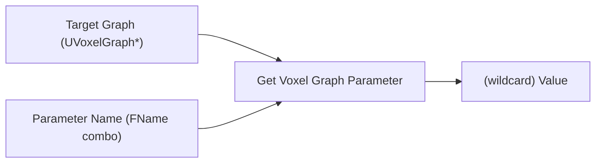
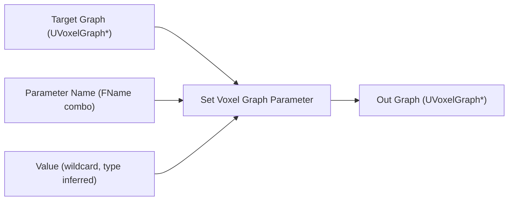
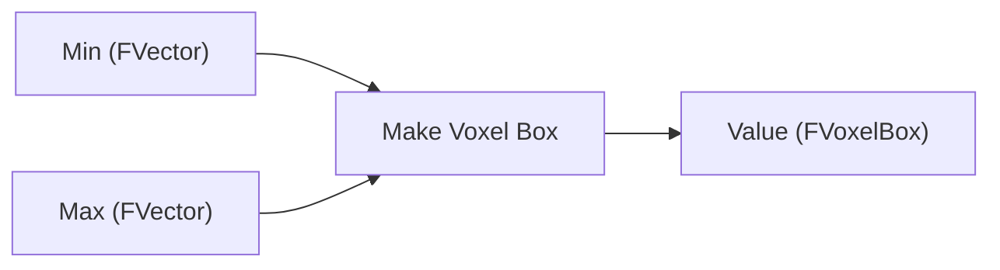
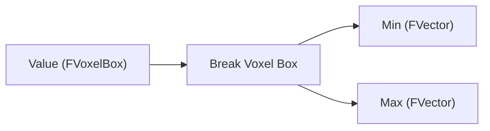

# VoxelBlueprint — API Reference

Five K2 (Kismet) nodes that extend the Blueprint compiler so voxel graphs are first-class in Blueprint workflows. Specifically: typed get/set for voxel-graph parameters, and make/break for voxel pin values.

Path: `Plugins/Voxel/Source/VoxelBlueprint/Public/`. Module type: `UncookedOnly` — these classes exist for the editor's Kismet compiler and are never cooked into a packaged build.

Dependencies: `VoxelCoreEditor`, `Voxel`, `VoxelEditor`, `VoxelGraph`, `VoxelGraphEditor`, plus `BlueprintGraph` and `KismetCompiler`.

KB (usage angle): <https://docs.voxelplugin.com/knowledgebase/blueprints/setting-graph-parameters.html>.

## What "K2 node" means

A `UK2Node` is a node Kismet draws and compiles. Unlike a normal `UFUNCTION`, a K2 node can:

- Change its pin shape based on connected types or referenced assets (wildcards).
- Expand into multiple native function calls at compile time (`ExpandNode`).
- Synthesize a context menu and palette presence on its own terms.

VoxelBlueprint uses this to:

1. Resolve a graph-parameter name → typed pin at compile time, so Blueprints can `Get`/`Set` parameters without manual casting.
2. Auto-generate Make/Break nodes for any struct implementing `FVoxelPinType`.

## Base node

### `UK2Node_VoxelBaseNode` (abstract, extends `UK2Node_CallFunction`)

The shared base for every Voxel K2 node. Provides the wildcard-pin / type-promotion plumbing used by both the parameter and make/break families.

```cpp
class UK2Node_VoxelBaseNode : public UK2Node_CallFunction
{
    // Pin types
    virtual bool IsPinWildcard(UEdGraphPin*) const;

    // When a pin's type changes (e.g., connection made), propagate to related pins
    virtual void OnPinTypeChange(UEdGraphPin*);

    // Right-click context: "Convert pin to <type>"
    virtual void AddConvertPinContextAction(...);

    // Compile-time expansion → native function calls
    virtual void ExpandNode(...) override;
};
```

The promotion logic keys off the Voxel-specific `FVoxelPinType` (declared in [VoxelGraph.md](VoxelGraph.md#runtime-values)), not Epic's `EPinType`. That's why a `Get Parameter` node can output `FVoxelFloatBuffer`, `FVoxelBox`, `UStaticMesh*`, etc., with the same node template.

## Parameter access — Get / Set

### `UK2Node_VoxelGraphParameterBase` (abstract)

Shared base for all parameter K2 nodes. Holds the cached parameter info and target graph type info.

```cpp
struct FVoxelGraphBlueprintParameter
{
    FGuid       Guid;
    FName       Name;
    FVoxelPinType Type;
};

class UK2Node_VoxelGraphParameterBase : public UK2Node_VoxelBaseNode
{
    UPROPERTY()
    FVoxelGraphBlueprintParameter CachedParameter;

    UPROPERTY()
    TWeakObjectPtr<UVoxelGraph> CachedGraph;

    virtual UEdGraphPin* GetParameterNamePin();
    virtual UClass* GetGraphClassType();    // UVoxelHeightGraph / UVoxelVolumeGraph / ...
    virtual FName    GetGraphPinName();     // "TargetHeightGraph", "TargetVolumeGraph", ...
};
```

The `ParameterName` pin renders as a combo of parameters discovered on the connected graph. Once a parameter is selected, the value pin type is inferred from `CachedParameter.Type`. The actual runtime call dispatches to a guid-resolved function.

### `UK2Node_GetVoxelGraphParameter`

Reads a parameter value from a target graph.



There are concrete subclasses per graph type (`UK2Node_GetVoxel<Height|Volume|HeightSculpt|VolumeSculpt|...>GraphParameter`) — `GetGraphClassType()` returns the matching `UVoxelGraph` subclass so the picker only lists relevant parameters.

`ExpandNode()` resolves the parameter GUID into a runtime `UVoxelGraphParameterBlueprintLibrary` function call at compile time.

### `UK2Node_SetVoxelGraphParameter`

Writes a parameter value and returns the modified graph.



Compile expansion synthesizes both the get-current and assignment ops as native function calls.

## Make / Break voxel pin values

These nodes synthesize struct-decomposition nodes for any type implementing `FVoxelPinType`. For example, you get a `Make FVoxelBox` node with `Min`/`Max` input pins for free, without writing per-type C++.

### `UK2Node_MakeBreakVoxelPinValueBase` (abstract, extends `UK2Node_VoxelBaseNode`)

```cpp
class UK2Node_MakeBreakVoxelPinValueBase : public UK2Node_VoxelBaseNode
{
    UPROPERTY()
    FVoxelPinType CachedType;       // remember what we're making/breaking

    virtual FName GetValuePinName();
};
```

### `UK2Node_MakeVoxelPinValueBase`

Assembles individual field pins into a Voxel compound struct.



### `UK2Node_BreakVoxelPinValueBase`

Decomposes a Voxel compound struct into field pins.



Both expand at compile time into native field-access function calls. Because the type is wildcard-driven, **any** new `FVoxelPinType` automatically gets Make/Break support — no per-type editor work needed.

## Workflow notes

- Get/Set nodes need a concrete graph class hooked to the target graph pin; the parameter dropdown is empty until the type is known.
- `Set` returns the modified graph as an output rather than mutating in place — this is consistent with Voxel's preference for value-style parameter overrides.
- Make/Break inherit type from the connected pin. If you start from an empty Make node, the right-click "Convert pin to…" menu (provided by `UK2Node_VoxelBaseNode::AddConvertPinContextAction`) lets you pick the target type explicitly.

## Cross-references

- The parameter system is declared in [VoxelGraph.md](VoxelGraph.md#parameter-system).
- `FVoxelPinType` / `FVoxelPinValue` / `FVoxelRuntimePinValue` are documented under [VoxelGraph.md → Runtime values](VoxelGraph.md#runtime-values).
- The complementary BP-callable surface lives in `UVoxelParameterBlueprintLibrary` (in the `Voxel` module — see [Voxel.md](Voxel.md#graphs-specialized)).
- For graph-parameter access from PCG (instead of Blueprint), see [VoxelPCG.md → Drive-side](VoxelPCG.md#drive-side--call--configure-voxel-graphs).
