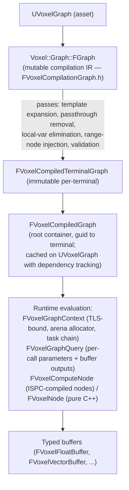

# VoxelGraph — API Reference

The visual-graph authoring system. Defines the source asset (`UVoxelGraph`), a multi-pass compiler, a typed buffer-based data-flow model, the runtime evaluation context, and the node library (math, noise, gradient, control flow, function-library calls).

Path: `Plugins/Voxel/Source/VoxelGraph/Public/`. Loads at `Default` phase. Built on `VoxelCore` plus `Chaos`, `PhysicsCore`, `Json`, `TraceLog` (and `MessageLog` in editor).

Official KB on graph authoring (not API): <https://docs.voxelplugin.com/knowledgebase/working-with-graphs/>.

## High-level pipeline



A single voxel graph asset can contain multiple **terminal graphs** (an output graph plus subgraphs and function libraries). Each terminal compiles independently into a `FVoxelCompiledTerminalGraph`. At runtime, a query targets one terminal by guid.

## Source asset

**`VoxelGraph.h` — `UVoxelGraph`**

| Member | Purpose |
|---|---|
| Terminal graph map (guid → `UVoxelTerminalGraph*`) | Multi-output graphs. |
| `FVoxelParameter` array | Exposed parameters, keyed by guid. |
| Base graph chain | Inheritance chain for parameter/graph reuse. |
| Editor metadata | Category, display name, tags. |
| `GetCompiledGraph()` | Returns cached `FVoxelCompiledGraph`, recompiling on invalidation. |

**`VoxelTerminalGraph.h` — `UVoxelTerminalGraph`** holds function inputs/outputs, local variables, and the serialized node list. **`VoxelTerminalGraphRuntime.h` — `UVoxelTerminalGraphRuntime`** bridges editor → compiled form.

**`VoxelGraphMigration.h`** — versioning/upgrade plumbing for asset-format changes.

## Compilation pipeline

### `FVoxelCompilationGraph` — the IR

`VoxelCompilationGraph.h` defines `Voxel::Graph::{FGraph, FNode, FPin}` — the mutable working representation during compilation.

```cpp
namespace Voxel::Graph
{
    class FGraph
    {
        FNode* NewNode(UStruct* nodeType);
        // ... cloning, integrity checks
    };

    class FNode
    {
        FPin* FindInput(FName);
        FPin* FindOutput(FName);
        // errors queued here, not raised — lets us keep compiling
    };

    class FPin
    {
        void MakeLinkTo(FPin* Other);
        FVoxelPinType Type;
    };
}
```

Errors are queued on the offending node rather than aborting; an unused node with bad pins won't kill the whole compile.

### `FVoxelGraphCompiler` — passes

`VoxelGraphCompiler.h` orchestrates:

1. Load serialized graph into `FVoxelCompilationGraph`.
2. **Template expansion** — `FilterBuffer` / `NearlyEqual` template nodes specialize per concrete type.
3. **Passthrough removal** — `MakeStruct` followed by `BreakStruct`, or `MakeValue` then `Equal`, collapse.
4. **Local-variable elimination** — `VoxelLocalVariableNodes` get inlined.
5. **Range-node injection** — `RangeDebug` instruments paths used by editor previews.
6. **Validation** — cycle detection, parameter/type consistency, function I/O matching, guid uniqueness. Wildcard pins propagate errors instead of crashing.

`VoxelGraphCompileScope.h` provides RAII-style scoping for compile-time state (current compiler, error sink).

### `FVoxelCompiledTerminalGraph` — immutable output

`VoxelCompiledTerminalGraph.h` — readonly per-terminal compilation result. Stored as homogeneous arrays per concrete `FVoxelNode` struct type for cache-friendly iteration.

```cpp
template<typename TNode>
TVoxelArrayView<const TNode> GetNodes() const;

int32 NumNodes() const;
int32 NumPins() const;
```

Ownership validation in debug to catch use-after-recompile.

### `FVoxelCompiledGraph` — root container

`VoxelCompiledGraph.h` — holds `FVoxelCompiledTerminalGraph`s keyed by terminal guid. Cached on `UVoxelGraph` and invalidated through the [VoxelCore dependency tracker](VoxelCore.md#dependency-tracking).

## Runtime evaluation

### `FVoxelGraphContext`

`VoxelGraphContext.h` is the per-evaluation execution container.

```cpp
class FVoxelGraphContext
{
    static FVoxelGraphContext& Get();   // TLS — one per thread
    // Task chain with inline lambda storage (256 bytes/task) avoiding heap thrash
    // Arena allocator (16-byte pages, 16 KB/page) for query-scoped parameters
    // Callstack tracking (editor only) for graph error context
    // Auto-destructor invocation for allocated objects
};
```

Bound to a thread via TLS — every node evaluation accesses the active context to allocate parameters, push subtasks, or report errors.

### `FVoxelGraphQuery`

`VoxelGraphQuery.h` is the per-call query wrapper.

```cpp
class FVoxelGraphQuery
{
    // Uniform parameters indexed by type
    template<typename T> const T& GetParameter() const;

    // Buffer parameters (runtime buffers)
    template<typename T> const T& GetBufferParameter() const;

    // Pin-value storage (computed/uncomputed tracking)
    template<typename T> T& GetPinValue(FPinRef pin);
    bool IsNodeComputed(FVoxelGraphNodeRef) const;

    // Sub-queries for function calls
    FVoxelGraphQuery CreateChildQuery(...) const;
};
```

`FVoxelGraphQueryImpl` is the concrete implementation (the public `FVoxelGraphQuery` is a thin handle).

### `FVoxelGraphEnvironment`

`VoxelGraphEnvironment.h` packages the compiled root graph, parameter overrides, and world transform.

```cpp
static FVoxelGraphEnvironment Create(UVoxelGraph* Graph, ...);
static FVoxelGraphEnvironment CreatePreview(...);  // marked as preview scene
```

### `FVoxelGraphTracker`

`VoxelGraphTracker.h` — dependency-tracking helper specialized for graphs. Receives invalidation signals when the graph or its parameters change.

### `FVoxelGraphNodeRef`

`VoxelGraphNodeRef.h` — guid + type-safe lookup into a compiled terminal graph. The handle you use when you need to refer to a specific node from outside the graph (e.g., from a function library or an external parameter).

## Buffer system

The data currency between nodes. **Nodes consume and produce typed buffers** — arrays of values in struct-of-arrays (SoA) layout that pair well with ISPC.

### Base

**`VoxelBuffer.h` — `FVoxelBuffer`** (abstract):

```cpp
template<typename T> bool IsA() const;
template<typename T> const T& As() const;

static TSharedRef<FVoxelBuffer> MakeEmpty(UScriptStruct*);
static TSharedRef<FVoxelBuffer> MakeDefault(UScriptStruct*);
static TSharedRef<FVoxelBuffer> MakeConstant(const FVoxelRuntimePinValue&);

void Allocate(int32 Num);
void ShrinkTo(int32 Num);

void IndirectCopyFrom(const FVoxelBuffer&, TConstArrayView<int32> srcIndices);
void Gather(const FVoxelBuffer&, ...);
void Replicate(const FVoxelBuffer&, int32 count);
void Split(/* into N buffers */) const;
void Merge(/* from N buffers */);

void Serialize(FArchive&);

void SetGeneric(int32, FVoxelRuntimePinValue);
FVoxelRuntimePinValue GetGeneric(int32) const;
```

### Typed buffers (`Buffer/`)

| Header | Concrete types |
|---|---|
| `VoxelFloatBuffers.h` | `FVoxelFloatBuffer`, `FVoxelVector2DBuffer`, `FVoxelVectorBuffer` |
| `VoxelDoubleBuffers.h` | `FVoxelDoubleBuffer` |
| `VoxelIntegerBuffers.h` | `FVoxelInt32Buffer` |
| `VoxelNormalBuffer.h` | `FVoxelNormalBuffer` (octahedral-encoded) |
| `VoxelNameBuffer.h` | `FVoxelNameBuffer` |
| `VoxelClassBuffer.h` | `FVoxelClassBuffer` |
| `VoxelRangeBuffers.h` | `FVoxelRangeBuffer` |
| `VoxelSoftObjectPathBuffer.h` | `FVoxelSoftObjectPathBuffer` |
| `VoxelGraphStaticMeshBuffer.h` | Static-mesh-reference buffers |
| `VoxelBaseBuffers.h` | Shared base/utilities for the above |

`DECLARE_VOXEL_BUFFER(T, BufferType)` declares the bidirectional `T` ↔ buffer type relationship that the templating/conversion utilities key off of.

### Buffer support

- **`VoxelBufferAccessor.h`** — templated element accessor.
- **`VoxelBufferSplitter.h`** — splits compound buffers (e.g., vector → X/Y/Z floats).
- **`VoxelBufferStruct.h`** — base for structured buffers.
- **`VoxelGenericStructBuffer.h`** — runtime support for user-defined struct buffers.

### Buffer utilities (`Utilities/`)

- `VoxelBufferConversionUtilities.h` — type conversions.
- `VoxelBufferGradientUtilities.h` — numerical gradients (used by distance-field nodes).
- `VoxelBufferMathUtilities.h` — per-buffer arithmetic (add, multiply, normalize).
- `VoxelBufferTransformUtilities.h` — affine transforms applied to coordinate buffers.

## Parameter system

Parameters are the inputs a graph exposes for runtime override.

| Header | Type |
|---|---|
| `VoxelParameter.h` *(included via `VoxelGraph.h`)* | `FVoxelParameter` — name, type, default, guid. |
| `VoxelGraphParameters.h` | `FVoxelGraphParameters`, `FVoxelGraphParameterManager`. Splits into `FUniformParameter` (POD scalars) and `FBufferParameter` (array-backed). The manager indexes parameter types globally. |
| `VoxelGraphParametersView.h` | Immutable parameter snapshot passed to nodes. |
| `VoxelGraphParametersViewContext.h` | Allocation scope during query execution. |
| `VoxelGraphPositionParameter.h` | The implicit world-position input (X, Y, Z, LOD). |
| `VoxelExposedSeed.h` | Thread-safe random seed (`FVoxelGraphParameters::FSeed`). |
| `VoxelExternalParameter.h` | Bridge for BP / C++ to override parameters at runtime. |

## Runtime values

| Header | Type |
|---|---|
| `VoxelPinType.h` | `FVoxelPinType` — type descriptor; distinguishes a buffer type (`FVoxelFloatBuffer`) from its inner scalar type (`float`). |
| `VoxelPinValue.h` | `FVoxelPinValue` — editor-side default values (serializable). |
| `VoxelRuntimePinValue.h` | `FVoxelRuntimePinValue` — compact 40-byte union (bool/int/float/double/name/class/struct), buffer values via `FSharedVoidPtr`. |
| `VoxelPin.h` | `FVoxelPin`, `FVoxelPinMetadata` — pin name, sort order, flags (template/variadic/hide/array/position/no-cache/no-default), display name, category, tooltip. |
| `VoxelRuntimeStruct.h` | Runtime struct-pin wrapper. |

## Node system

### Base

`VoxelNode.h` defines `FVoxelNode` — node base inheriting `FVoxelVirtualStruct`. Pin declarations use macros:

```cpp
VOXEL_INPUT_PIN(float, Radius, 1.0f);
VOXEL_OUTPUT_PIN(FVoxelFloatBuffer, Density);
VOXEL_TEMPLATE_INPUT_PIN(T, Value);
VOXEL_VARIADIC_INPUT_PIN(FVoxelPointSet, Inputs);
```

Typed pin references — `FPinRef_Input<T>`, `FPinRef_Output<T>` — give compile-time safety when reading/writing values from inside `Compute()`:

```cpp
virtual void Compute(FVoxelGraphQuery Query) const override
{
    const float R = Query.GetPinValue(RadiusPin);
    FVoxelFloatBuffer& Out = Query.GetPinValue(DensityPin);
    // ...
}
```

Methods to override: `IsPureNode()`, `CanBeQueried()`, `CanBeDuplicated()`, `Compute()`.

### `FVoxelComputeNode`

`VoxelComputeNode.h` extends `FVoxelNode` for ISPC-compiled nodes. `VoxelComputeNodeImpl.h` provides the implementation glue.

```cpp
virtual FString GenerateCode() const override;  // ISPC/C++ snippet
```

Cached function pointers wire compiled ISPC kernels to the node at runtime.

### `VoxelNodeDefinition.h` (editor)

Hierarchical pin/parameter definition for the node-tree UI. Supports categories, variadic pins, nesting.

### Node families (`Nodes/`)

| Family | Headers | Notes |
|---|---|---|
| **Math** | `VoxelMathNodes.h`, `VoxelTemplatedMathNodes.h`, `VoxelMathConvertNodes.h`, `VoxelOperatorNodes.h` | Trig, sqrt, abs, sign, min/max, pow, log, exp, lerp, float↔int conversions, infix operators. |
| **Clamp/lerp** | `VoxelClampNodes.h`, `VoxelLerpNodes.h`, `VoxelInterpolationNodes.h` | Clamp, lerp, inverse-lerp, cubic, Catmull-Rom, smoothstep. |
| **Comparison/logic** | `VoxelCompareNodes.h`, `VoxelBoolNodes.h` | `==`/`<`/etc., AND/OR/NOT/Select. |
| **Noise** | `VoxelNoiseNodes.h`, `VoxelAdvancedNoiseNodes.h`, `VoxelDomainWarpNodes.h`, `VoxelGradientNodes.h` | Perlin/Worley/Simplex/value; fBm + ridged multifractal; domain warp; gradient. |
| **Vector** | `VoxelVectorNodes.h`, `VoxelRandomNodes.h` | Vector ops, random vector. |
| **Array** | `VoxelArrayNodes.h` | Array construction/decomposition. |
| **Random** | `VoxelRandomNodes.h`, `VoxelNode_RandomSelect.h` | Random scalar + random element. |
| **Control flow** | `VoxelNode_Select.h`, `VoxelNode_Equal.h`, `VoxelNode_HeightSplitter.h`, `VoxelTemplateNode_FilterBuffer.h`, `VoxelTemplateNode_NearlyEqual.h` | Conditional outputs, splitters, templated filters. |
| **Struct** | `VoxelNode_MakeStruct.h`, `VoxelNode_BreakStruct.h`, `VoxelNode_MakeValue.h` | Compose/decompose typed structs; constant value. |
| **Parameter** | `VoxelNode_Parameter.h`, `VoxelNode_CustomizeParameter.h` | Graph parameter reference + per-use metadata override. |
| **Function** | `VoxelNode_FunctionInput.h`, `VoxelNode_FunctionOutput.h`, `VoxelCallFunctionNodes.h`, `VoxelNode_UFunction.h` | Subgraph boundaries; calls to other graphs and native `UFUNCTION`s. |
| **Local variable** | `VoxelLocalVariableNodes.h` | Inlined by the compiler. |
| **Position** | `VoxelNode_OverrideDownstreamPosition.h` | Modify position passed downstream. |
| **Debug** | `VoxelNode_RaiseError.h`, `VoxelNode_RangeDebug.h`, `VoxelNode_ValueDebug.h`, `VoxelNode_AppendNames.h` | Compile-time error emission, editor preview tags. |

## Function libraries

### Library framework

| Header | Type |
|---|---|
| `VoxelFunctionLibrary.h` | `UVoxelFunctionLibrary` — library registry. `RegisterFunction()` caches signature and exec pointer; `Call()` marshals buffer args. |
| `VoxelFunctionLibraryAsset.h` | `UVoxelFunctionLibraryAsset` — Blueprint-editable user library. |

The [VoxelUHT extension](Modules.md#uht-extension) is what makes adding a new function-library node a one-`UFUNCTION` job — it generates the graph-side glue at build time.

### Built-in libraries (`FunctionLibrary/`)

| Library | Surface |
|---|---|
| `UVoxelBasicFunctionLibrary` | Abs, Min, Max, Clamp, Lerp, Frac. |
| `UVoxelBoxFunctionLibrary` | Box collision/SDF queries. |
| `UVoxelCurveFunctionLibrary` | `UCurveFloat` / `UCurveVector` evaluation. |
| `UVoxelMathFunctionLibrary` | Vector/matrix ops, smoothstep, normalize, dot, cross. |
| `UVoxelPositionFunctionLibrary` | Position transforms, distance, direction. |
| `UVoxelAutocastFunctionLibrary` | Type promotions (float→double, etc.). |

## Preview handlers

Editor-time visualization of intermediate values.

`VoxelPreviewHandler.h` — `FVoxelPreviewHandler` base. `Initialize()` and `GetColors()` rasterize the value; `Compute()` returns an async colored image for the editor viewport. Mouse position tracking enables per-pixel inspection in the graph editor.

`Preview/` subfolder:

| Header | Type |
|---|---|
| `VoxelBoolPreviewHandler.h` | Black/white. |
| `VoxelFloatPreviewHandlers.h` | Single (grayscale) and triple (RGB). |
| `VoxelDoublePreviewHandlers.h` | Double-precision. |
| `VoxelIntegerPreviewHandlers.h` | Integer visualization. |
| `VoxelScalarPreviewHandler.h` | Generic scalar. |
| `VoxelEnumPreviewHandler.h` | Enum colormapping. |
| `VoxelDistanceFieldPreviewHandlers.h` | Distance field with isosurface. |
| `VoxelGenericPreviewHandler.h` | Fallback. |

`VoxelNode_Preview.h` — drop-in node that captures a debug snapshot for the preview pane.

KB: <https://docs.voxelplugin.com/knowledgebase/working-with-graphs/debugging-graphs.html>.

## ISPC integration

`VoxelISPCNodeHelpers.h` — binds compiled ISPC kernels to `FVoxelComputeNode`. The kernel side uses the layout structs declared in [`VoxelCore`'s `VoxelISPC.h`](VoxelCore.md#ispc-bridge). The build system (`Source/VoxelCore/Private/BuildISPC-windows.txt` / `BuildISPC-linux.txt`) is described in [Modules.md](Modules.md#ispc-and-the-build-script).

## Message tokens

`VoxelGraphMessageTokens.h`, `VoxelMessageToken_GraphCallstack.h` — custom message tokens that attach a graph callstack to errors, so editor diagnostics point at the offending node + call path.

## Default node definition

`VoxelDefaultNodeDefinition.h` — automatic pin/parameter extraction from struct properties. The reason a `VOXEL_INPUT_PIN` declaration is enough for the editor to lay out a node without writing custom UI code.

`VoxelOutputNode.h` — terminal output node base; subclassed in the [`Voxel/Graphs/`](Voxel.md#graphs-specialized) folder by `UVoxelOutputNode_OutputHeight`, `_OutputVolume`, etc.

## Cross-references

- The `Voxel/Graphs/` subfolder defines the concrete graph types (`UVoxelHeightGraph`, `UVoxelVolumeGraph`) — see [Voxel.md](Voxel.md#graphs-specialized).
- PCG nodes that drive graphs (`PCGCallVoxelGraph`, parameter-override settings) live in [VoxelPCG.md](VoxelPCG.md#drive-side-call--configure-voxel-graphs).
- K2 nodes for getting/setting graph parameters from Blueprints are in [VoxelBlueprint.md](VoxelBlueprint.md).
- The buffer/container substrate (`TVoxelArray`, ISPC bridge) comes from [VoxelCore.md](VoxelCore.md).
