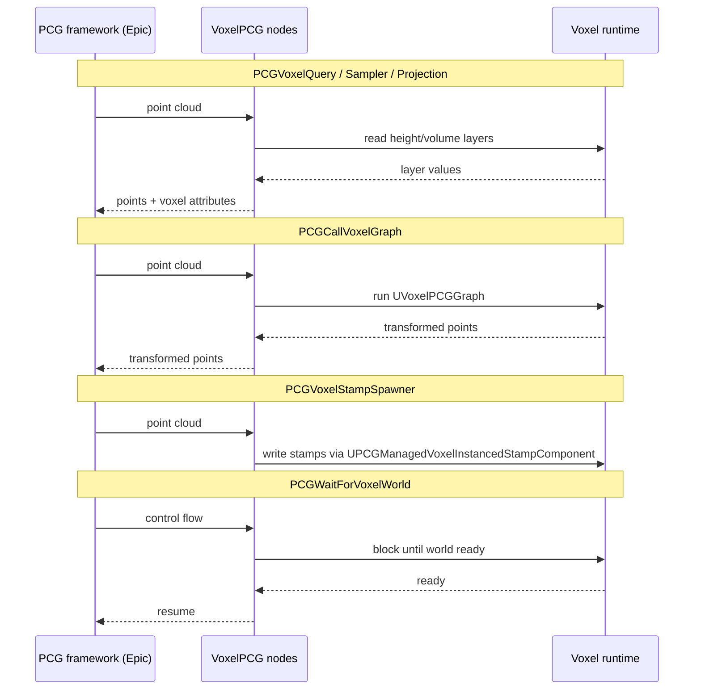

# VoxelPCG — API Reference

The bridge between Epic's PCG (Procedural Content Generation) framework and the Voxel plugin. Provides PCG nodes that read voxel state, drive voxel graphs, and write back voxel stamps — plus voxel-graph nodes that operate on PCG-style point sets.

Path: `Plugins/Voxel/Source/VoxelPCG/Public/` (flat, no subfolders). Depends on `Voxel`, `VoxelGraph`, `PCG`.

KB: <https://docs.voxelplugin.com/knowledgebase/foliage/>.

## Integration pattern



Every PCG-side node derives from `UVoxelPCGSettings` (extends `UPCGSettings`). Voxel-side point-graph nodes derive from `FVoxelNode` — they operate on `FVoxelPointSet` inside a voxel graph, distinct from the PCG-side wrappers.

## Common base

### `UVoxelPCGSettings`

Base for all PCG-side nodes. Enforces Voxel-specific serialization.

```cpp
class UVoxelPCGSettings : public UPCGSettings
{
    UPROPERTY(EditAnywhere)
    bool bTrackLayerChanges = true;     // invalidate on layer-dep changes

    virtual TSharedRef<FVoxelPCGOutput> CreateOutput(...) const;
};
```

### `FVoxelPCGOutput`

Async output wrapper.

```cpp
class FVoxelPCGOutput
{
    virtual FVoxelFuture Run() = 0;   // execute, return future of result
    // Deriving classes hold layer refs, settings snapshot, output containers
};
```

### `UVoxelPCGGraph`

Specialized voxel graph for PCG use. Subclass of `UVoxelGraph` whose terminal output node is `FVoxelOutputNode_OutputPoints` (instead of the height/volume output terminals).

### `UVoxelPCGFunctionLibrary`

Voxel-graph-side utilities:

```cpp
UFUNCTION(BlueprintCallable, Category = "Voxel | PCG")
static FVoxelBox GetPCGBounds();    // bounds of current PCG execution
```

Available inside voxel graphs when invoked via `PCGCallVoxelGraph`.

## Read-side nodes — query, sample, project

### `UPCGVoxelQuerySettings`

Reads voxel-world data at PCG point positions.

```cpp
UPROPERTY(EditAnywhere)
FVoxelStackLayer Layer;          // which layer stack to sample

UPROPERTY(EditAnywhere)
int32 LOD = 0;

UPROPERTY(EditAnywhere)
FName HeightOrDistanceAttribute = "VoxelHeight";

// optional: also write surface-type and custom metadata attributes
```

Augments each input point with the queried attributes. Use it when you have a PCG point cloud and need each point to know what's under it.

### `UPCGVoxelSamplerSettings` (sampler node)

Generates fresh PCG points on a voxel-world surface.

```cpp
UPROPERTY(EditAnywhere) FVoxelStackLayer Layer;
UPROPERTY(EditAnywhere) float PointsPerSquaredMeter = 1.0f;
UPROPERTY(EditAnywhere) float CellSize = 100.0f;
UPROPERTY(EditAnywhere) float Looseness = 0.5f;
UPROPERTY(EditAnywhere) float Tolerance = 0.1f;
UPROPERTY(EditAnywhere) bool bResolveSmartSurfaceTypes = true;
UPROPERTY(EditAnywhere) int32 LOD = 0;
```

Takes an optional bounding shape (or falls back to actor bounds).

### `UPCGVoxelSamplerV2Settings`

Experimental variant — replaces density (points/m²) with target inter-point spacing (`DistanceBetweenPoints`). Same layer/LOD/metadata flow.

### `UPCGVoxelProjectionSettings`

Projects input points onto a voxel-world surface via raymarching.

```cpp
UPROPERTY(EditAnywhere) FVoxelStackLayer Layer;
UPROPERTY(EditAnywhere) float KillDistance = -1.0f;   // prune unreachable
UPROPERTY(EditAnywhere) bool  bUpdateRotation = true;
UPROPERTY(EditAnywhere) bool  bForceDirection = false; // search downward
UPROPERTY(EditAnywhere) int32 MaxSteps = 64;
UPROPERTY(EditAnywhere) float Tolerance = 0.1f;
UPROPERTY(EditAnywhere) float Speed = 1.0f;
UPROPERTY(EditAnywhere) float GradientStep = 1.0f;
UPROPERTY(EditAnywhere) bool  bDebugSteps = false;
```

### `UPCGVoxelElevationIsolines`

Computes contour lines (isolines) for height layers.

```cpp
UPROPERTY(EditAnywhere) FVoxelStackLayer Layer;       // height-only
UPROPERTY(EditAnywhere) float ElevationStart = 0.f;
UPROPERTY(EditAnywhere) float ElevationEnd   = 1000.f;
UPROPERTY(EditAnywhere) float ElevationIncrement = 100.f;
UPROPERTY(EditAnywhere) float Resolution = 100.f;
UPROPERTY(EditAnywhere) bool  bOutputAsSpline = false;
UPROPERTY(EditAnywhere) bool  bLinearSpline = false;
```

Use case: contour maps, terraced landscaping, elevation-banded foliage gradients.

## Drive-side — call & configure voxel graphs

### `UPCGCallVoxelGraphSettings`

Invokes a voxel graph from PCG, threading PCG point data in.

```cpp
UPROPERTY(EditAnywhere) UVoxelPCGGraph* Graph;
UPROPERTY(EditAnywhere) FVoxelParameterOverrides ParameterOverrides;
UPROPERTY(EditAnywhere) TMap<FName, UClass*> ObjectAttributeToType;
```

Dynamic input/output pins are generated from the target graph's `FVoxelOutputNode_OutputPoints` pin definitions. Execution is async-capable.

### `UPCGApplyOnVoxelGraphSettings`

Loads a graph by soft path (sourced from a PCG attribute) and applies property overrides before invoking.

```cpp
UPROPERTY(EditAnywhere) FName ObjectReferenceAttribute = "VoxelGraphRef";
UPROPERTY(EditAnywhere) TArray<FVoxelPropertyOverrideDescription> PropertyOverrideDescriptions;
UPROPERTY(EditAnywhere) bool bSynchronousLoad = false;
```

Use case: per-point instance customization where each point carries its own graph reference + overrides.

### `FVoxelPCGGraphParameterOverrides`

Struct referenced by the above settings. Maps voxel-graph parameters onto PCG-overridable values; part of the `IVoxelParameterOverridesOwner` contract.

## Write-side — spawn stamps & actors

### `UPCGVoxelStampSpawnerSettings`

Spawns voxel-stamp instances at PCG point locations.

```cpp
UPROPERTY(EditAnywhere) FVoxelStampRef NewTemplate;   // e.g., FVoxelHeightmapStamp
UPROPERTY(EditAnywhere) TSoftObjectPtr<AActor> TargetActor;

UPROPERTY(EditAnywhere)
TArray<FVoxelPropertyOverrideDescription> SpawnedStampPropertyOverrideDescriptions;

UPROPERTY(EditAnywhere)
TArray<FVoxelGraphParameterOverrideDescription> SpawnedGraphParameterOverrideDescriptions;

UPROPERTY(EditAnywhere)
TArray<FName> PostProcessFunctionNames;
```

Auto-creates or reuses a `UPCGManagedVoxelInstancedStampComponent` on the target actor for stamp pooling — the lifetime of created stamps is managed by PCG so re-runs don't leak.

### `UPCGManagedVoxelInstancedStampComponent`

`UPCGManagedComponent` subclass that wraps a `UVoxelInstancedStampComponent`. Implements PCG's managed-component lifecycle:

```cpp
void ReleaseIfUnused();
void MarkAsUsed();
void MarkAsReused();
void ResetComponent();
void SetRootLocation(const FVector&);
```

`SettingsUID` is cached so the same component is reused (or reset) when settings change.

### `UPCGSpawnActorWithVoxelGraphSettings`

Spawns actor instances at PCG points, each with custom voxel-graph parameter values.

```cpp
UPROPERTY(EditAnywhere) TSubclassOf<AActor> TemplateActor;

UPROPERTY(EditAnywhere)
TArray<FVoxelPropertyOverrideDescription> SpawnedActorPropertyOverrideDescriptions;

UPROPERTY(EditAnywhere)
TArray<FVoxelGraphParameterOverrideDescription> SpawnedGraphParameterOverrideDescriptions;

UPROPERTY(EditAnywhere)
TArray<FName> PostSpawnFunctionNames;          // CallInEditor functions

UPROPERTY(EditAnywhere) FAttachmentTransformRules AttachOptions;
UPROPERTY(EditAnywhere) bool bInheritActorTags = true;
UPROPERTY(EditAnywhere) EPCGGenerationTrigger GenerationTrigger;

UPROPERTY(EditAnywhere) bool bSpawnByAttribute = false;
UPROPERTY(EditAnywhere) FName SpawnAttribute;  // spawn iff attribute == true
```

## Synchronization

### `UPCGWaitForVoxelWorldSettings`

Control-flow node — blocks PCG execution until the voxel world is ready to render. Type: `EPCGSettingsType::ControlFlow`. Output is a pass-through of the input.

Use case: ensure terrain is generated before downstream sampling/stamping operations that would otherwise sample stale data.

## Voxel-side point-graph nodes

These are **voxel graph nodes** (`FVoxelNode`-derived) that operate on `FVoxelPointSet` inside a voxel graph — typically a `UVoxelPCGGraph` invoked via `PCGCallVoxelGraph`.

| Node | Purpose |
|---|---|
| `FVoxelNode_GetInputPoints` | Pure node exposing the input point set from PCG. Output: `Points` (`FVoxelPointSet`). |
| `FVoxelNode_ScatterPoints` | Random child points around each parent. Inputs: `In`, `Radius`, `RadialOffset` (deg), `NumPoints`, `Seed`. Output: child points only. |
| `FVoxelNode_PruneByDistance` | Culls points closer than `Distance` to each other. |
| `FVoxelNode_MergePoints` | Variadic merge of multiple point sets (≥2 inputs). |
| `FVoxelNode_GenerateSurfacePoints2D` | Generates points on a heightmap surface. Inputs: `Bounds` (`FVoxelBox`), `Height` (`FVoxelFloatBuffer`), `CellSize`, `Jitter`, `Seed`. Internal positions + gradient computation. |
| `FVoxelNode_RaymarchLayerDistanceField` | Raycasts into a distance-field layer. Inputs: `In`, `Layer`, `MaxDistance`, `StepSize`. Output: intersection points. |
| `FVoxelOutputNode_OutputPoints` | Terminal node — variadic input pins (`InputPins`, `PinNames`). Each pin becomes a dynamic output on the `PCGCallVoxelGraph` node. Editor allows add/remove/rename pins. |

## Support / utilities

| Header | Purpose |
|---|---|
| `VoxelPCGCallstack.h` | Custom message-callstack token for PCG-graph errors. |
| `VoxelPCGTracker.h` | Dependency-tracker specialization for PCG ↔ voxel invalidation. |
| `VoxelPCGHelpers.h` | Shared helpers (point/attribute conversion, layer-id resolution). |
| `VoxelPointAttributeNodes.h` | Voxel-graph nodes for per-point attribute get/set. |
| `VoxelPointNodes.h` | Additional point-graph node implementations. |
| `VoxelPointNodesStats.h` | Stat scopes for profiling point operations. |
| `VoxelPointUtilities.h` | Point-set algorithm primitives. |

## Quick guidance — picking the right node

| You want to… | Use |
|---|---|
| Read terrain attributes at existing PCG points | `PCGVoxelQuery` |
| Generate new PCG points on the surface | `PCGVoxelSampler` (or V2) |
| Snap existing PCG points down onto the surface | `PCGVoxelProjection` |
| Get contour lines for a height layer | `PCGVoxelElevationIsolines` |
| Run a custom voxel graph on a PCG point cloud | `PCGCallVoxelGraph` + `UVoxelPCGGraph` |
| Pick a graph per-point from an attribute | `PCGApplyOnVoxelGraph` |
| Carve / heap / spline / heightmap stamps from PCG points | `PCGVoxelStampSpawner` |
| Spawn parameterized actors at PCG points | `PCGSpawnActorWithVoxelGraph` |
| Wait for terrain before doing the above | `PCGWaitForVoxelWorld` |

## Cross-references

- The stamps written by the spawner originate in [Voxel.md](Voxel.md#stamps) (`FVoxelStampRef`, the instanced-stamp component).
- `UVoxelPCGGraph` extends the graph-asset framework documented in [VoxelGraph.md](VoxelGraph.md).
- The `FVoxelPointSet` data type is declared in `Voxel/Public/VoxelPointSet.h` — see [Voxel.md](Voxel.md#misc-world-level).
- KB pages: [Configuring PCG](https://docs.voxelplugin.com/knowledgebase/foliage/configuring-pcg.html), [Using PCG on Voxel Terrains](https://docs.voxelplugin.com/knowledgebase/foliage/using-pcg-on-voxel-terrains.html), [Voxel PCG Graphs](https://docs.voxelplugin.com/knowledgebase/foliage/voxel-pcg-graphs.html).
